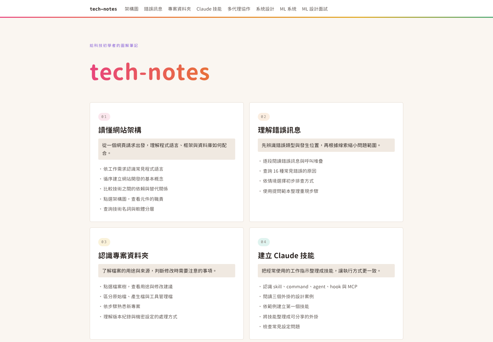
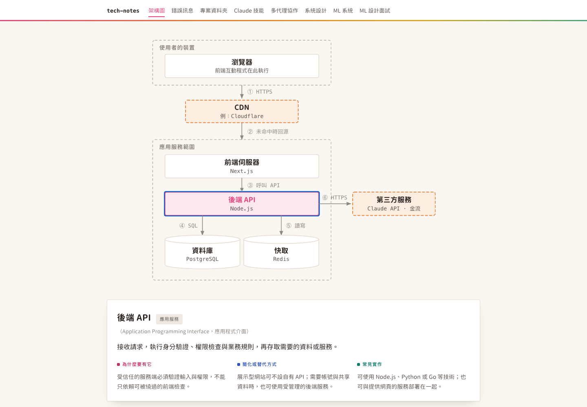
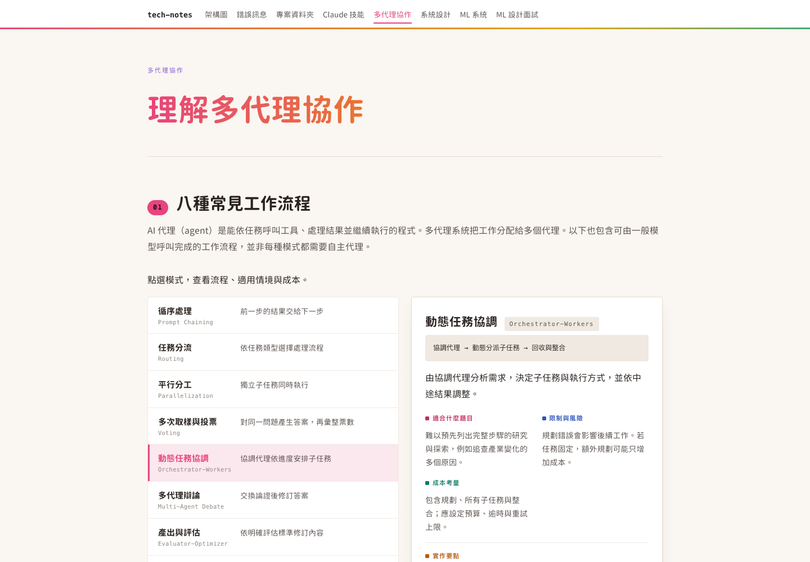
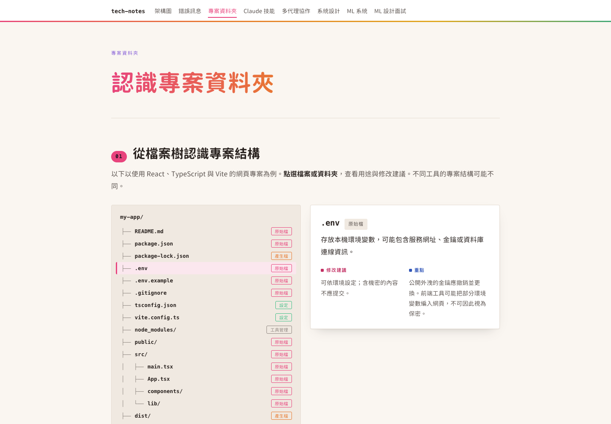

# tech-notes

給科技初學者的圖解筆記。從架構圖、錯誤訊息與專案資料夾開始，逐步認識 AI 工作流程、系統設計與機器學習產品。每篇文章搭配可點選的圖解與具體案例，說明技術的用途、運作方式與適用條件。

[閱讀網站](https://hsuiris.github.io/tech-notes/)



## 閱讀主題

| 文章 | 內容 |
|---|---|
| [看懂架構圖](https://hsuiris.github.io/tech-notes/architecture.html) | 從一次網頁請求，理解前端、後端、資料庫與部署環境的關係。 |
| [看懂錯誤訊息](https://hsuiris.github.io/tech-notes/errors.html) | 辨識錯誤類型、閱讀堆疊追蹤，整理可供重現與排查的資訊。 |
| [看懂專案資料夾](https://hsuiris.github.io/tech-notes/project.html) | 區分原始碼、設定與工具產生的檔案，理解修改及版本控制的注意事項。 |
| [建立 Claude 技能](https://hsuiris.github.io/tech-notes/skills.html) | 將重複的工作要求寫成技能，並理解技能、指令、子代理與外掛的關係。 |
| [理解多代理協作](https://hsuiris.github.io/tech-notes/agents.html) | 比較八種工作流程，評估分工、審查、協調成本與研究結果的限制。 |
| [系統設計](https://hsuiris.github.io/tech-notes/sysdesign.html) | 透過服務成長情境，理解快取、負載平衡、佇列與資料複寫的取捨。 |
| [機器學習系統](https://hsuiris.github.io/tech-notes/mlsystem.html) | 串連資料、訓練、推論與監控，認識 RAG 流程與常見評估指標。 |
| [ML 設計面試](https://hsuiris.github.io/tech-notes/mldesign.html) | 練習需求釐清、容量估算、模型與系統設計，說明每個決策的依據。 |

## 互動圖解

架構圖上的方塊可以點選。選擇「後端 API」後，可閱讀元件職責與實際請求流程。名詞表支援關鍵字搜尋與分類篩選。



多代理協作頁提供八種工作流程。點選其中一種，可比較適用條件、限制、成本與實作要點。



專案資料夾頁以檔案樹呈現常見結構。點選 `.env` 可閱讀環境設定的用途、機密資料處理方式與修改建議。



錯誤訊息頁支援搜尋，系統設計與面試頁可切換案例。Claude 技能頁附有可複製的範例，使用前需依自己的專案調整。

## 編寫原則

以科技初學者為讀者，使用自然的臺灣繁體中文。先說明讀者遇到的情境，再介紹概念與例子。必要術語保留英文，並在附近交代意思，避免讀者必須反覆查詢。

語氣保持專業、具體且尊重讀者。避免粗俗用詞、貶低初學者的敘述、誇張比喻與口號。用清楚的因果關係說明技術選擇，減少固定對比句式與重複排比。

區分事實、範例假設與建議。數字需交代計算條件或來源，研究結果需說明評估範圍。效能、成本與品質不以單一案例保證；涉及指令操作時，說明前提與可能影響。

## 技術架構

網站使用靜態 HTML、CSS 與原生 JavaScript，無須安裝前端框架。

| 部分 | 實作 |
|---|---|
| 頁面 | 每個主題一個 HTML 檔，包含該頁的樣式、圖解與互動資料。 |
| 共用樣式 | `assets/base.css`，支援依系統偏好切換淺色與深色主題。 |
| 圖解與互動 | 內嵌 SVG 與 JavaScript，處理點選、搜尋及案例切換。 |
| 捲動效果 | `assets/reveal.js`，尊重系統的減少動態效果設定。 |
| 字型 | 資源圓體 TW；以 `build.py` 建立網站所需的字型子集。 |
| 部署 | GitHub Pages，發布 `main` 分支的根目錄。 |

## 本機預覽

```bash
git clone https://github.com/hsuiris/tech-notes.git
cd tech-notes
python3 -m http.server 8000
```

在瀏覽器開啟 <http://localhost:8000>。修改 HTML 後重新整理即可預覽。

## 新增文章

1. 參考現有 HTML 頁面，設定標題、描述、導覽與文章內容。
2. 更新所有頁面的導覽列，在目前頁面的連結設定 `aria-current="page"`，並在首頁加入文章卡片。
3. 依下節重建字型子集，檢查桌面與手機版的文字、圖解和互動功能。

## 字型更新

使用 [資源圓體 Resource Han Rounded TW](https://github.com/CyanoHao/Resource-Han-Rounded)。`build.py` 掃描所有 HTML 與 CSS，僅保留使用到的字元，以減少網頁下載量。

先從 [Release 頁面](https://github.com/CyanoHao/Resource-Han-Rounded/releases)下載 `RHR-TW-*.7z`，將解壓縮後的 `ResourceHanRoundedTW-Regular.ttf` 與 `ResourceHanRoundedTW-Bold.ttf` 放入 `fonts/`。

```bash
python3 -m venv .venv
.venv/bin/pip install fonttools brotli
.venv/bin/python build.py
```

原始 TTF 不納入版本控制。已產生的 `assets/rhr-*.woff2` 隨網站提交，閱讀網站不需執行建置。新增文字後需重建子集；未涵蓋的字元會使用系統備援字型，外觀可能不同。

## 授權

文章內容採 CC BY 4.0。字型依 [SIL Open Font License 1.1](https://github.com/CyanoHao/Resource-Han-Rounded/blob/master/LICENSE.txt) 授權。
